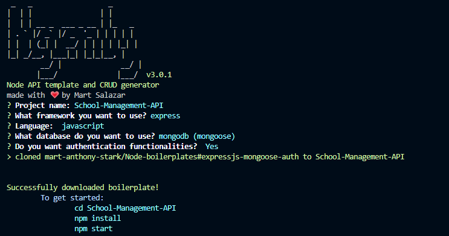
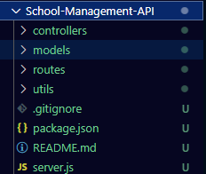

# Ngenly CLI

A node project boilerplate generator

## Installation

Install the package globally using yarn or npm

```console
npm install -g ngenly
```

## Usage

- execute in terminal
  ngenly [command]

## Commands

### Create a new project

```console
ngenly new
```



- Project Boilerplate will be created with its own folder
  
  > You can also generate project boilerplate with one-liner command
  > Usage: ngenly -g project [expressjs | expressts | fastifyjs | fastifyts] [projectName]

```console
ngenly -g project expressjs School-Management-API
```

### Generate CRUD files

> Usage: ngenly -g crud [expressjs | expressts | fastifyjs | fastifyts] [model_name]

```
ngenly -g crud expressjs user
```


- View the cli version

```console
ngenly -v
```

## Commands

| Command                             | Description                                      |
| ----------------------------------- | ------------------------------------------------ |
| `ngenly new`                        | Generates a new project                          |
| `ngenly [-g / generate]`            | Starts generating project or crud using menu     |
| `ngenly -v`                         | Returns cli version                              |
| `ngenly --version`                  | Returns cli version                              |
| `ngenly -g [crud] [library] [name]` | Generates crud files (Model, Controller, Router) |
| `ngenly --gui`                      | Opens the browser for ngenly GUI                 |
